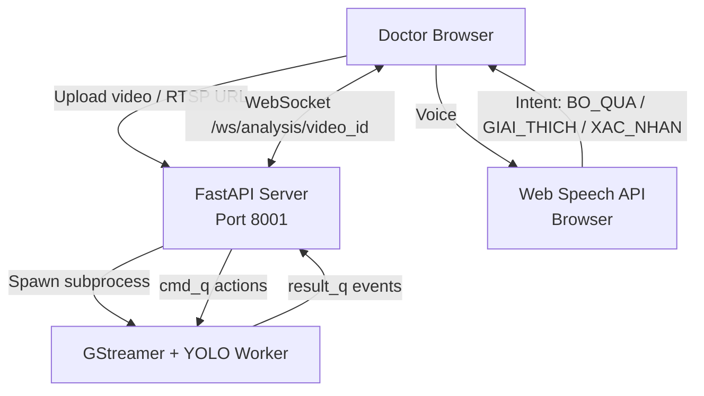
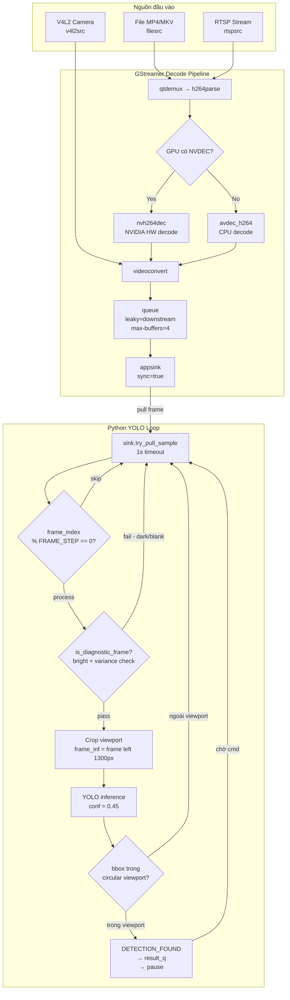
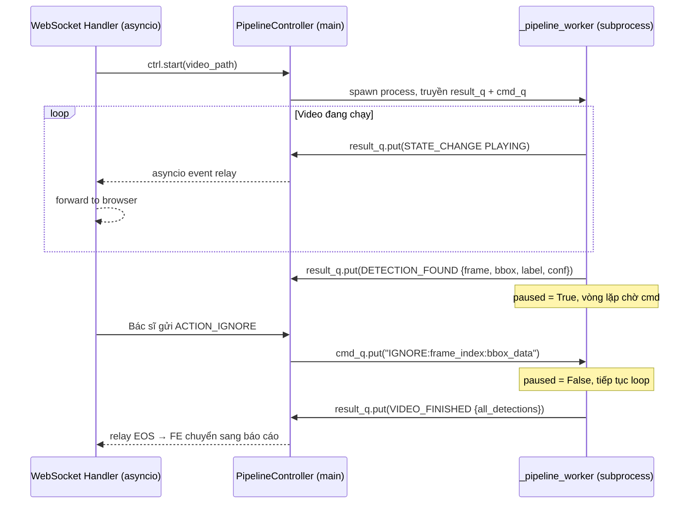
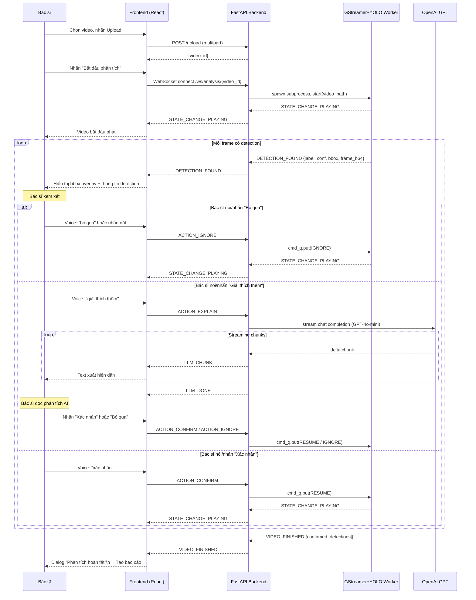
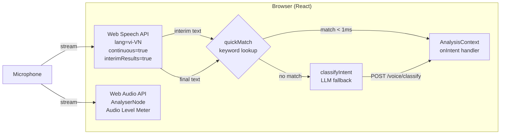
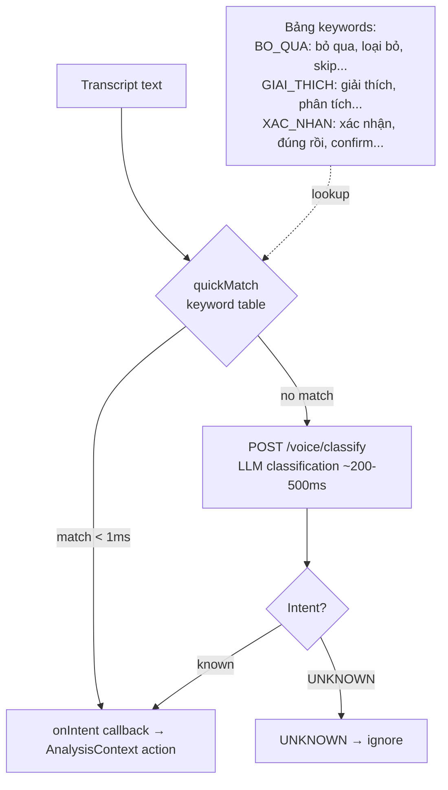

# Báo Cáo Tiến Độ – Endoscopy AI System
**Ngày:** 22/04/2026

---

## Tổng Quan Hệ Thống

### Sơ đồ kiến trúc



### Script giải thích

Hệ thống gồm 3 thành phần chính:

**1. Frontend (Next.js + React)** chạy trên browser của bác sĩ. Bác sĩ upload video nội soi hoặc kết nối RTSP stream. Frontend mở kết nối WebSocket tới backend và nhận real-time events. Song song đó, Web Speech API lắng nghe giọng nói của bác sĩ và chuyển thành lệnh điều khiển.

**2. Backend (FastAPI)** đóng vai trò trung gian. Khi bác sĩ kết nối WebSocket, backend spawn một subprocess riêng để chạy GStreamer + YOLO. Subprocess giao tiếp với backend qua 2 queue: `result_q` để đẩy events lên (detection, state change), `cmd_q` để nhận lệnh từ bác sĩ (ignore, confirm, explain).

**3. GStreamer + YOLO Worker** là subprocess độc lập, xử lý video và chạy AI inference. Kết quả gửi về backend, backend relay qua WebSocket tới frontend.

Lý do cần subprocess riêng: GStreamer dùng GLib thread model, CUDA fork không an toàn trong asyncio process — nếu chạy chung sẽ deadlock.

---

## 1. GStreamer Pipeline – Tích Hợp YOLO

### 1.1 Pipeline tổng thể



### Script giải thích – Tích hợp YOLO vào GStreamer

**GStreamer không chạy YOLO trực tiếp.** Đây là điểm quan trọng cần hiểu rõ.

GStreamer chịu trách nhiệm **decode video** — đọc file H.264, demux container, decode thành raw frame BGR. Output của GStreamer được đẩy vào một element đặc biệt gọi là **appsink** — tức là "sink do ứng dụng tự xử lý".

Python code gọi `sink.try_pull_sample()` trong một vòng lặp để lấy từng frame ra. Đây là điểm kết nối: GStreamer decode, Python lấy frame, Python chạy YOLO.

**Luồng cụ thể:**

```
GStreamer decode H264 frame
    ↓
appsink buffer (max 2 buffers)
    ↓
Python pull_sample() lấy raw bytes
    ↓
numpy array → OpenCV BGR frame
    ↓
Frame filtering (bỏ qua frame tối, blank)
    ↓
Crop viewport 1300px (bỏ panel thông tin bên phải)
    ↓
YOLO inference (conf=0.45)
    ↓
Filter bbox hình tròn (bỏ overlay thiết bị)
    ↓
DETECTION_FOUND → pause pipeline → chờ bác sĩ
```

**Tại sao dùng `appsink` thay vì GStreamer plugin?**

Có thể viết GStreamer plugin bằng C/C++ để chạy YOLO trực tiếp trong pipeline, nhưng cách đó phức tạp hơn nhiều. Dùng `appsink` + Python loop đơn giản hơn, dễ debug, và đủ nhanh vì YOLO chạy trên GPU — bottleneck là inference, không phải overhead Python.

**`sync=true` — Realtime pacing:**

`appsink` có property `sync`. Khi `sync=true`, GStreamer dùng pipeline clock để pace frame theo đúng tốc độ video gốc (ví dụ 30fps). Khi `sync=false`, pipeline chạy nhanh nhất có thể — video 5 phút xử lý xong trong 30 giây.

Hệ thống dùng `sync=true` để video frontend và backend đồng bộ. Nếu dùng `sync=false`, backend detect ở timestamp 4:30 trong khi video frontend chỉ đang ở 0:20 — frontend phải seek nhảy tới 4:30, gây trải nghiệm xấu.

### 1.2 Viewport crop và circular filter

```
Màn hình nội soi 1920×1080:

┌─────────────────────────────────────────────────┐
│                                                 │
│    ╭───────────────────╮    ┌───────────────┐   │
│    │                   │    │  Thông tin    │   │
│    │   Viewport tròn   │    │  bệnh nhân    │   │
│    │   (ảnh nội soi)   │    │               │   │
│    │                   │    │  NF/LCI/WLI   │   │
│    ╰───────────────────╯    │  indicators   │   │
│      ←── 1300px ───→        └───────────────┘   │
│    ←──────────── 1920px ───────────────────→    │
└─────────────────────────────────────────────────┘
```

**Script giải thích:**

Frame 1920×1080 gồm 2 phần: bên trái là ảnh nội soi thực (viewport tròn), bên phải là panel thông tin bệnh nhân, các indicator thiết bị (NF, LCI, WLI), thumbnail.

Nếu đưa full frame vào YOLO, model sẽ detect nhầm text, icon, thumbnail bên phải. Hơn nữa, model được train trên viewport-only crops nên scale distribution của bounding box khác với full frame — bbox sẽ sai tỉ lệ.

Fix: crop `frame[:, :1300]` trước khi inference. Tọa độ x của bbox vẫn đúng trong full-frame space vì origin (0,0) không thay đổi.

Sau crop vẫn còn góc đen ngoài vòng tròn scope. Thêm circular filter: tính tâm bbox `(cx, cy)`, nếu nằm ngoài circle tâm `(640, 540)` bán kính `520` thì skip — đây là vùng góc/overlay không phải mô bệnh học.

### 1.3 Communication giữa Main Process và Subprocess



**Script giải thích:**

Subprocess và main process không share memory — giao tiếp qua 2 multiprocessing Queue.

`result_q`: subprocess push events lên — DETECTION_FOUND, STATE_CHANGE, LLM_CHUNK, VIDEO_FINISHED. Main process có một coroutine chạy liên tục `_relay_events()` đọc queue và forward qua WebSocket tới frontend.

`cmd_q`: main process push lệnh xuống — RESUME, IGNORE, STOP. Subprocess drain queue đầu mỗi vòng lặp.

Khi phát hiện detection, subprocess set `paused = True` và sleep 20ms mỗi iteration, chờ cmd. Bác sĩ nhấn hoặc nói lệnh → frontend gửi action → WebSocket handler → `cmd_q.put("RESUME")` → subprocess tiếp tục.

---

## 2. Luồng Chạy Chính Của Toàn Hệ Thống



---

## 3. Xử Lý Âm Thanh – Voice Control

### 3.1 Kiến trúc



### Script giải thích

Voice control chạy **100% trên browser** — không gửi audio lên server, chỉ gửi text khi cần LLM classify.

**Web Speech API** nhận diện giọng nói Vietnamese (`lang=vi-VN`). Chế độ `continuous=true` giữ mic mở liên tục. `interimResults=true` trả về text realtime từng từ trước khi câu kết thúc.

**2 tầng phân loại intent:**
- Tầng 1 — `quickMatch`: so khớp keyword trong bảng cứng. Latency < 1ms. Bắt được ~90% lệnh thông thường.
- Tầng 2 — LLM fallback: khi không match keyword, gọi `POST /voice/classify` với transcript, GPT trả về intent. Latency ~200-500ms. Bắt được câu phức tạp hơn.

### 3.2 Vấn đề transcript tích lũy (Chrome)

Chrome `continuous=true` **không tự ngắt câu** — tích lũy từ liên tục cho đến khi có khoảng lặng dài. Ví dụ bác sĩ nói "bỏ qua" rồi ngừng, interim text sẽ là `"bỏ qua"` → `"bỏ qua đi"` → `"bỏ qua đi giải"`. Nếu so khớp toàn bộ string, sẽ fire intent BO_QUA 3 lần.

**Fix:** Dùng offset tracking — lưu `lastFiredEndRef` là vị trí đã xử lý. Mỗi lần interim cập nhật, chỉ match phần `delta = interim.slice(lastFiredEndRef)`. Khi fire intent, gọi `recognition.stop()` để flush buffer Chrome — Chrome kết thúc utterance hiện tại, tạo utterance mới từ 0.

```
interim "bỏ qua"         → delta[0:] = "bỏ qua" → BO_QUA → stop() ✓
recognition.stop() → buffer flush → restart
interim "giải thích thêm" → delta[0:] = "giải thích thêm" → GIAI_THICH ✓
```

### 3.3 Phân loại Intent – 2 tầng



---

## 4. Kết Quả & Vấn Đề Còn Tồn Tại

| Hạng mục | Trạng thái |
|---|---|
| GStreamer decode H264 CPU/GPU | ✅ Hoạt động |
| YOLO inference viewport crop | ✅ Bbox đúng tỉ lệ |
| Circular viewport filter | ✅ Loại bỏ overlay FP |
| Realtime sync (sync=true) | ✅ Video FE và BE đồng bộ |
| Voice intent recognition | ✅ Latency ~0ms (interim) |
| LLM explain streaming | ✅ Chunked response |
| Per-detection LLM insight | ✅ Lưu theo từng detection |
| Post-LLM confirm/ignore flow | ✅ Hoạt động |
| GstShark profiling | ✅ Enabled, metrics hiện trên báo cáo |
| Detection card modal | ✅ Click xem frame + full insight |
| Model accuracy | ⚠️ Cần đánh giá trên test set đầy đủ |
| Tiếng Việt ASR accuracy | ⚠️ Chrome vi-VN chưa ổn định |
| RTSP live stream | ⚠️ Chưa test thực tế |
